# **Oasis by Made In XHS**

**Team:** Jacqueline Lim (Product), Sky Lee (Engineering — logic & backend), Tracia (Engineering — frontend), Huixuan (UI/UX)

**Problem Statement:** Stress & Workload Manager — *Beating the Burnout* (Lifestyle track)

**Video Presentation:** [YouTube link](https://youtu.be/VlFzc__r_-Q)

**Presentation Slides:** [Canva Link](https://www.canva.com/design/DAHVAl1I0tU/sGUmYqhRkVY0EfCcf5aoYA/view)

> **Every wellbeing app can tell a student they are overloaded. Oasis tells them what to say no to — and writes the sentence.**

**Live app:** https://oasis-beating-the-burnout.vercel.app — no sign-up; open it on a phone, or in a 430×932 browser window.

---

## **1. Project Overview**

**The Problem.**

It is 11:47 PM. The DS Assignment 2 group chat has three replies and zero volunteers for a report due Friday. Maya types *"tak apa lah, I just do"*. Minutes later her shift manager asks if she can cover Friday evening, 5pm to 11pm, and needs to know by tonight. She is already short on sleep and has a deadline that same day. She says yes anyway, because saying no feels rude — *segan*, *paiseh*, *excuse me*.

Nothing about that night is a mystery, and none of it shows up anywhere. The causes:

1. **Five loads stack up, and a calendar shows one.** Coursework, sleep, a packed timetable, physical strain and the commute all draw on the same week. A calendar only shows time blocks, so a 40-minute bus ride each way and a 5-hour night are invisible.
2. **Group work splits unevenly, and nobody reports it.** The peer evaluation form arrives after submission, and everyone gives everyone 5/5.
3. **Segan makes the yes come out.** Turning down a manager, a senior or a friend feels impolite, so students agree first and pay later.
4. **Help is reactive.** Research on student mental health in Malaysia describes "a reactive rather than preventive pattern" [3] — support tends to arrive once things have already gone wrong.
5. **Apps measure, but never decide.** Mood trackers and focus timers record the stress. None of them say which request to turn down.

**Who is affected:** Malaysian undergraduates carrying a group assignment alongside a commute and/or a part-time job — where a shift counts as hours on the books, just like a lecture.

| Stakeholder | How the overload reaches them |
| :-- | :-- |
| Students (primary users) | Say yes past what the week can hold; sleep is cut first |
| Teammates | Either carry the assignment silently or inherit it late |
| People who ask — shift managers, club organisers, classmates | Get answers shaped by guilt rather than capacity |
| Lecturers | Rely on peer evaluation forms that never surface uneven effort |
| University counselling services | Usually meet students after the crisis, not before it |

**The scale of it:**

- **1,264,541** students were enrolled in Malaysian higher education institutions as at 31 Dec 2025 [1].
- **50%** of 1,602 first-year undergraduates at a Malaysian public university reported moderate to extremely severe anxiety [2].
- Help-seeking follows **a reactive, not preventive, pattern** [3].

**Similar apps, and why they fall short:**

| App | What it does | Where it falls short for this student |
| :-- | :-- | :-- |
| Daylio | Mood and activity journal | Records how the week felt; never looks at what is on it or what to drop |
| Finch | Self-care pet that rewards small wellness tasks | Soothes the stress; the workload that caused it is untouched |
| Forest | Focus timer | Helps a student work longer; nothing asks whether the work should be theirs |
| Notion / Google Calendar | Time blocks and task lists | A lecture and a report crunch look the same; sleep and commute are absent; a new ask goes straight in |
| University peer evaluation form | Rates teammates after submission | Arrives too late, and social pressure makes every score 5/5 |

Each of these is **measurement without a decision**. The hard part — *should I take this on?* — is still left to the student at 11:47 PM.

<sub>**Sources**
[1] *International students account for 12.6% of higher education institutions' enrolment, says ministry*, The Star, 5 Jul 2026 — https://www.thestar.com.my/news/nation/2026/07/05/international-students-account-for-126-of-higher-education-institutions039-enrollment-says-ministry
[2] Amir Hamzah, N. S. et al. (2019). *The prevalence and associated factors of depression, anxiety and stress of first year undergraduate students in a public higher learning institution in Malaysia.* Journal of Child and Family Studies, 28(12), 3545–3557 — https://research.monash.edu/en/publications/the-prevalence-and-associated-factors-of-depression-anxiety-and-s/
[3] Kamarudin, N. et al. (2026). Healthcare, 14(16), 2606 — https://doi.org/10.3390/healthcare14162606</sub>

**Our Solution.**

Oasis is a phone-browser app that needs no sign-up. It reads a student's whole week — coursework hours, sleep, how packed the timetable is, heart rate against their own baseline, and commute — into one energy score that shows its working. When someone asks for more, Oasis prices the ask against that week *before* the student says yes, returns accept, negotiate or decline, and for group work shows the effort-weighted split and who is carrying it. Then it drafts the decline, the counter-offer or the group message — and never sends anything itself.

**Core capabilities**

1. **Energy score with receipts** — 0 to 100 from five weighted factors; every deduction is printed with the input that caused it.
2. **Verdict before the yes** — paste the message; Oasis reads who is asking, how many hours, when it lands and how urgent it is, then returns accept / negotiate / decline with every penalty listed.
3. **Drafted replies** — a decline, a counter-offer (half the hours, at least 1) or a yes, written for the student to copy and send themselves.
4. **Effort-weighted group split** — shares by task points, not task count; anyone above 1.5× an even share is flagged, and Oasis drafts the WhatsApp message that raises it.
5. **Recovery re-plan in points** — six actions, each worth points against the factor it repays, ordered by that week's heaviest factor. Projected, not banked.

**Supporting features**

- **Daily check-in** — three questions: *How did you sleep? How are you feeling today? How does today look?* The sleep answer replaces last night's figure.
- **Schedule & load** — the week as blocks, a deadline radar, *Add to this week*, and *Import calendar*: an `.ics` file is previewed before anything is written, likely duplicates arrive unticked, and weekly repeats are expanded.
- **Group** — a list of every assignment the student is in, *New assignment* with an invite code and link, *Add task*, assign, mark done.
- **Requests inbox** — asks waiting on an answer, each opening its verdict.
- **Oasis AI** — ask about the week, add or remove a commitment ("drop the Ethics reading"), or paste a message to negotiate. Any change is a proposal until the student taps **Confirm**.
- **Me** — named patterns, the student's own track record and achievements as counts. No streaks. *Show my record* is off by default.
- **Smart band** page, opened from Home.
- **Crisis safeguard** — checked before Oasis AI answers (see §4).

**The number, worked for the demo week** (Maya, Wed 9 Sep 2026):

| Factor | Weight | Fully loaded at | Maya's week | Points taken |
| :-- | --: | :-- | :-- | --: |
| Academic hours | 30 | 40 h of work — the only factor allowed past its ceiling, up to 1.5× | 33 h on the books | 25 |
| Sleep | 25 | a 4 h floor, against a 7.5 h target | 5.4 h a night | 15 |
| Calendar density | 20 | 18 blocks a week, rest excluded | 11 blocks | 12 |
| Physiological strain | 15 | 20 bpm over the student's own resting baseline | 78 bpm, +6 | 5 |
| Commute | 10 | 10 h a week | 4 trips, 5.3 h | 5 |
| **Energy** | | `round(100 − Σ weight × ratio)` | | **100 − 62 = 38 · Near capacity** |

Zones: **60 and up Optimal · 30–59 Near capacity · below 30 Overloaded.** Heart rate is only 15 of the 100 — the rest comes from the timetable and the check-in, so Oasis works for a student with no wearable.

---

## **2. Ideation & Process**

### **2.1 Ideas We Considered**

| Idea | Why it was dropped / kept |
| :-- | :-- |
| **Beating the Burnout track (Chosen)** | Chosen unanimously on 31 Aug: every member had lived the problem, and it had the sharpest student user |
| **An energy budget, not a stress rating (Chosen)** | Merged Jacqueline's *Energy Budget* and Sky's *energy value*. A budget can be spent, so a new ask has a price |
| **Transparent weighted sum, not ML (Chosen)** | The PRD's stage ② proposed AI/ML stress scoring. `energy.ts` (5 Sep) replaced it with a weighted sum a student can check line by line — no training data, nothing opaque |
| **Computed zones + deadline radar (Chosen)** | From Tracia's red/yellow/green day tags and 3-day view. Zones are computed from the score instead of self-tagged |
| **Verdict before the yes (Chosen)** | Jacqueline's and Sky's "should I take this?" chatbot, plus Huixuan's worry about students crashing mid-week. PRD stage ⑤ |
| **Drafted replies from templates, no LLM (Chosen)** | Jacqueline's communication assist, narrowed to one pasted message. Templates mean a draft never says something the student did not mean |
| **Effort-weighted group split (Chosen)** | Grew out of Sky's idea of weighting each member's contribution from the travel brainstorm. Counts effort, so a five-point build is not one slide deck |
| **Recovery re-plan in points (Chosen)** | PRD stage ⑥. Built 5 Sep so recovery speaks the same unit as the score |
| **Daily check-in instead of sleep reminders (Chosen)** | Jacqueline's. Three questions, no push notifications — an app about overload should not nag |
| **Oasis AI with Confirm (Chosen)** | From the calendar-chatbot ideas. The agent proposes; nothing changes until the student confirms |
| **`.ics` import instead of live calendar sync (Chosen)** | Every calendar exports `.ics`; no OAuth review, no CORS, nothing leaves the phone |
| **Mobile web (Chosen)** | Huixuan's platform question, settled in the PRD: a link opens on any phone with no install and no store review |
| **Crisis safeguard (Chosen)** | Raised by mentor Justin on 7 Sep; built 10 Sep |
| **Own track record + achievements (Chosen)** | Justin's "Steam history" idea, kept as the student's own record with counts rather than ratings |
| **Named patterns (Chosen)** | Varsha's MBTI suggestion, reframed: the student names the pattern, Oasis measures it |
| **Hand-coded React as the source of truth (Chosen)** | A Figma Make sync overwrote the code on 9 Sep; restored from commit `27b1828` and kept in git since |
| Planning an Escape (trip-planning track) | The other shortlisted track, with sub-ideas: an AI mediator for group deadlocks, weather re-planning, offline Bluetooth/LAN sync, DuitNow/TNG payment QR, a Halal + vegetarian filter, a bot that reads the group chat, auto booking, backup plans, split-then-merge calendars. Dropped when the team chose burnout on 31 Aug |
| ML stress score trained on a Kaggle dataset | Dropped for the weighted sum: a score a student cannot check is a score they ignore |
| Reading WhatsApp / Telegram in the background | Dropped: reading private chats breaks the privacy rule. The student pastes the one message instead |
| Live Google Calendar / Gmail / Notion sync | Dropped for now: OAuth review, and browsers block fetching an iCal URL (CORS). `.ics` file import instead |
| Smart Band as a nav tab | Dropped 5 Sep: Group took the slot. The band page opens from Home |
| Peer rating of teammates | Dropped: it cannot be verified and is worthless until other users arrive (see §2.3). Own record instead |
| MBTI-based recovery | Reframed into named patterns |
| Streaks | Dropped: one missed day becomes guilt, and guilt becomes an uninstall |
| Home-screen widget + PWA install | Cut 10 Sep to protect the core flow. The manifest and icons remain; install returns in Building Phase week 3 |
| Dedicated commute screen | Cut 10 Sep. The commute still charges the score through `commuteHours()` |
| Burnout forecast + buffer days | Deferred to Building Phase week 2 |
| Shadow calendar and location-aware recovery | PRD ideas; out of scope — both need location tracking |
| Localization | The UI stays English for now; the crisis check already reads English and Chinese |
| Figma Make v1 | Replaced by hand-coded React after the 9 Sep overwrite |

### **2.2 Ideation Boards**

Redrawn as diagrams from our 31 Aug discussion log, PRD v1.0 and the repo history.

**Board 1 — Problem tree**

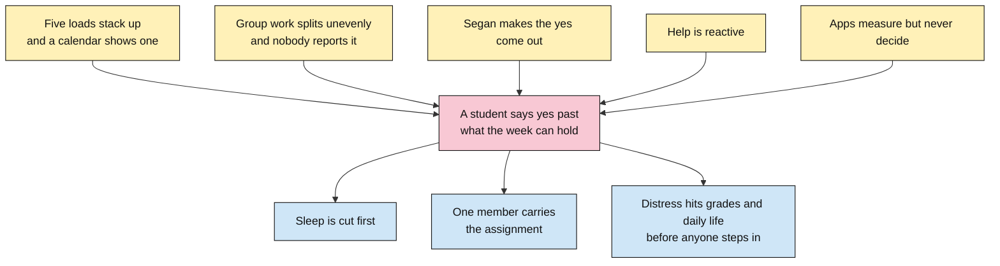

*Five causes feed one behaviour, and that behaviour is the thing Oasis intervenes on — not the stress itself, but the yes.*

**Board 2 — From the PRD's seven stages to what the prototype does**

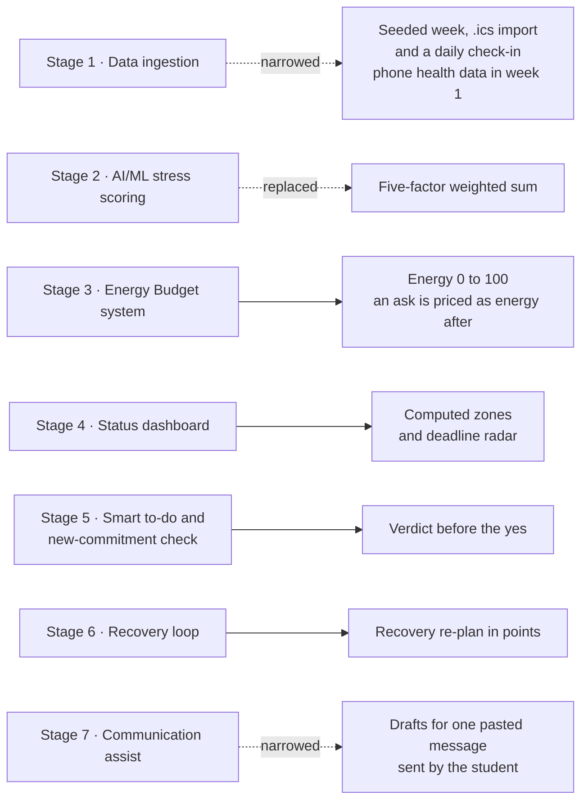

*Solid lines were built as planned; dashed lines were narrowed or replaced. Three things are not in the PRD at all and came from mentors and testing: the group split, the crisis safeguard, and patterns with the student's own record.*

**Board 3 — The energy model and the verdict**

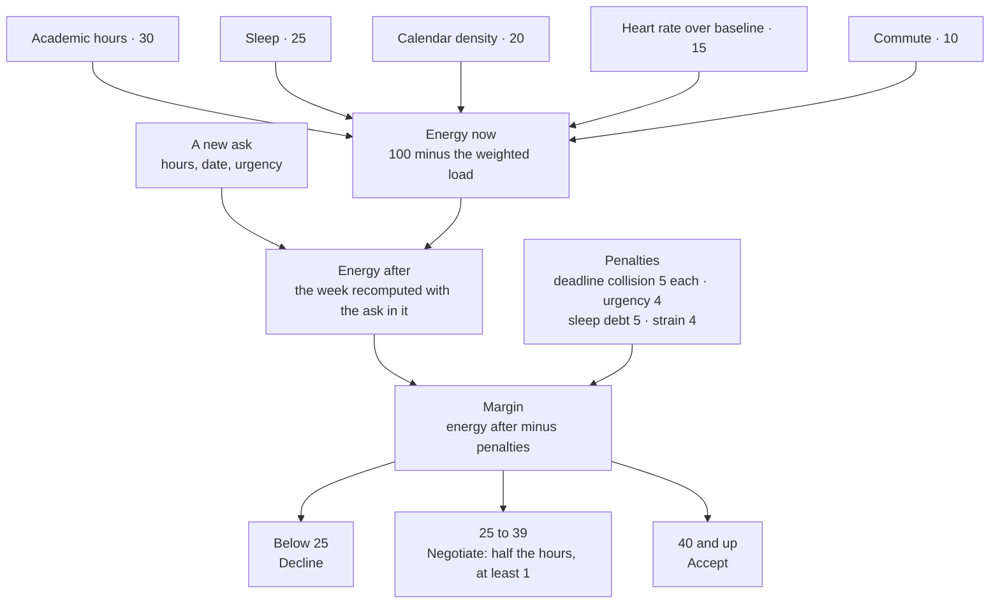

*Farah's ask in the demo week: 38 now, 33 after. DS Assignment 2 is due the same day (−5), the ask is urgent (−4) and Maya averages under 6 h of sleep (−5), so the margin is 33 − 5 − 4 − 5 = 19 — decline. Her heart rate is only +6 over baseline, so there is no strain penalty.*

**Board 4 — One night, end to end**

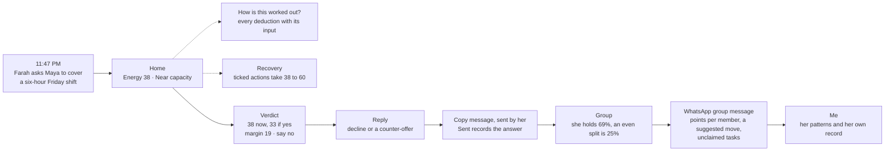

*The demo path. Dotted lines are side trips a first-time user takes to check the number before trusting it.*

**Board 5 — How the build actually went**

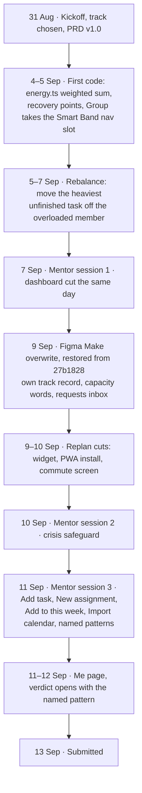

*Dates come from the git history. Each cut is recorded with its date in [BUILD-PLAN.md](BUILD-PLAN.md), and larger features have a written spec and plan in [docs/superpowers/](docs/superpowers/).*

### **2.3 Mentor Consultation**

| Date | Mentor | Feedback Received | What Was Changed |
| :-- | :-- | :-- | :-- |
| 7 Sep 2026 | Chua Zhu Heng (Justin) | Define *which* students, not just "students" | Narrowed the target user to Malaysian undergraduates carrying a group assignment alongside a commute and/or a part-time job. The demo week is one of them: Maya, a 40-minute bus ride each way, a part-time job interview, and a shift manager asking her to cover Friday evening |
| 7 Sep 2026 | Chua Zhu Heng (Justin) | Cut features — the scope is too wide | Cut the same day (commit `e55bc8b`): dashboard hero text and quote removed, biometrics combined into one card, widget promo removed, today's tasks shown instead. The 9–10 Sep replan then cut the home-screen widget, PWA install and the commute screen |
| 7 Sep 2026 | Chua Zhu Heng (Justin) | Add a performance-based review for teaming, "like Steam history" | **Adopted, reframed.** `record.ts` (9 Sep) builds a student's *own* record — on-time rate, share of team weight, achievements — opened from their own row only and private until they tap *Show my record*. No peer ratings: those would break the rule that teammates never see each other's numbers |
| 7 Sep 2026 | Chua Zhu Heng (Justin) | Gamify — add achievements | **Partly adopted.** Achievements are counts of things that happened, which cannot break. No streaks (see the table below) |
| 7 Sep 2026 | Chua Zhu Heng (Justin) | Group progress tracking needs more than manual input | **Partly.** Progress was already computed from task weights, and unowned tasks were already named. Capacity words (*At capacity / Loaded / Has room*) followed on 9 Sep, and *Add task* and assigning on 11 Sep. Marking a task done is still a tap until the Building Phase sync |
| 7 Sep 2026 | Chua Zhu Heng (Justin) | Humanise the AI — an AI once agreed with a depressed user, with serious consequences | Added a crisis check that runs before Oasis AI answers (10 Sep): English and Chinese patterns, a slang filter so "that exam killed me" does not trigger it, Malaysian lifelines, and a pre-written message to a trusted contact (a demo contact in the prototype) |
| 7 Sep 2026 | Chua Zhu Heng (Justin) | Keep the storyline tied to the problem statement | The pitch and this README follow one student, Maya, through one night of the problem |
| 10 Sep 2026 | Varsha Selvakumar | The UI is good; make a first-time viewer understand it faster | The receipt rule already covered the score. On 11 Sep it was extended to the new pattern cards, so every figure ships with the sentence that produced it — *60% of what Oasis has seen · averaging 5.4h a night against a 7.5h target* |
| 10 Sep 2026 | Varsha Selvakumar | Stay on-brief — the app should *solve* the overload, not just report it | No new screen: re-planning was already the core. Recovery actions priced in points (built 5 Sep) and the rebalance that proposes moving the heaviest unfinished task (5–7 Sep) were in the build |
| 10 Sep 2026 | Varsha Selvakumar | Check whether the phone's own health data can be read — most students have no watch | Agreed. Scheduled for Building Phase week 1 (HealthKit / Health Connect via Capacitor), with the check-in as the fallback. The same idea shipped for the timetable on 11 Sep: `.ics` calendar import. Heart rate is only 15 of the 100, so the score works with no health data |
| 10 Sep 2026 | Varsha Selvakumar | Personalise recovery using the person's MBTI | **Reframed.** A type the app assigns would be the only unsourced claim in Oasis. `pattern.ts` (11 Sep) lets the student pick up to 3 of four patterns they recognise, and Oasis attaches what it has measured, with the receipt — or says *nothing to read yet* |
| 10 Sep 2026 | Varsha Selvakumar | Keep the pitch on the problem statement, not project management | The group assignment is framed as where the energy engine *lands* — the ask Maya gets and the split she carries are priced by the same score — rather than a second product |
| 10 Sep 2026 | Varsha Selvakumar | Rating teammates is allowed, but the data must be accurate — and with few early users, what attracts anyone to it? | **Those two conditions are why peer rating stayed out.** An opinion score cannot be verified; task weight actually closed can. A rating is worthless until other users arrive; a student's own record (built 9 Sep) is useful on day one, and moved onto the Me page on 12 Sep |
| 11 Sep 2026 | Janelle Tan | The UI/UX is good | No change; the design language stayed as it was |
| 11 Sep 2026 | Janelle Tan | The prototype does not let you *add* anything — no new assignment, no new task | Shipped 11 Sep: *Add task* on a project, *New assignment* with an invite code and link, *Add to this week* on Schedule & load, and *Import calendar*. The Group tab now opens on a list of assignments |
| 11 Sep 2026 | Janelle Tan | Recovery methods could be personalised | **Partly.** The verdict now opens with the pattern the student named (commit `bb43da4`, 12 Sep). Recovery actions are ordered by the costliest factor in that week, but are not yet tailored to the pattern |
| 11 Sep 2026 | Janelle Tan | What data are the stress deductions based on? Make it more granular | Already in the build: *How is this worked out?* opens *Where the numbers come from*, which prints each deduction with its input (*33h of work on the books, against a 40h week*), and *Why this verdict* lists every penalty. Figures added since follow the same rule |

Where we did not take feedback literally — the Steam-style review, streaks, MBTI and peer rating — the reason is in the row. The one apparent contradiction, a mentor asking us to gamify an app whose rule is *no guilt mechanics*, resolves like this:

| Mechanic | Built? | Why |
| :-- | :-: | :-- |
| Achievements as counts | ✅ | A count of something that happened cannot break, so stopping for a semester costs nothing |
| Streaks | ❌ | One missed day becomes guilt |
| Leaderboards / peer comparison | ❌ | Turns a wellbeing app into a ranking of teammates |
| Own track record | ✅ | Private until the student shows it — their evidence, not someone else's opinion |

---

## **3. Design & Prototype**

**UI Prototype:** https://oasis-beating-the-burnout.vercel.app

Public, no sign-up. It opens on a seeded week for Maya at 38. Press **Shift+D** (or add `?demo=1`) for a scenario bar: *Week one · All clear · Near capacity · Red zone*.

<table>
<tr>
<td width="50%" valign="top"><p align="center">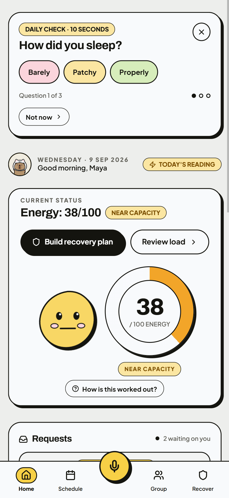</p><b>1 · Home</b><br>Good morning, Maya — Wed 9 Sep 2026. Energy 38/100, <i>Near capacity</i>, with the three-question check-in on top, <i>How is this worked out?</i> one tap away, and 2 requests waiting on her.</td>
<td width="50%" valign="top"><p align="center">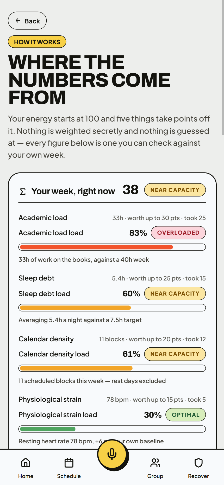</p><b>2 · Where the numbers come from</b><br>Each factor prints its input and what it took: 33h of work took 25, 5.4h of sleep took 15, 11 blocks took 12, 78 bpm took 5 — and the commute takes the last 5. 100 − 62 = 38.</td>
</tr>
<tr>
<td width="50%" valign="top"><p align="center">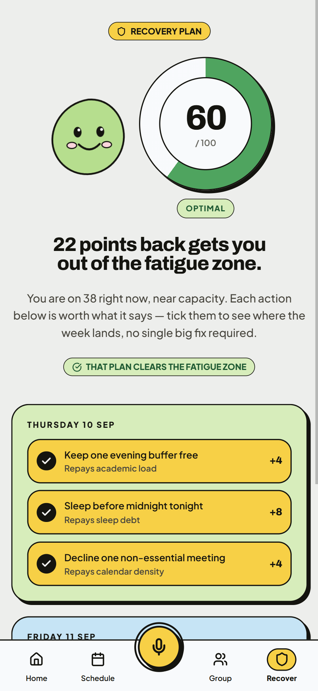</p><b>3 · Recovery</b><br>Six actions, each worth points against the factor it repays, heaviest factor first across Thu 10 and Fri 11 Sep. Ticking four (+4 keep an evening free, +8 sleep before midnight, +4 decline a meeting, +6 batch campus trips) projects 38 → 60: <i>That plan clears the fatigue zone.</i> Projected, not banked.</td>
<td width="50%" valign="top"><p align="center">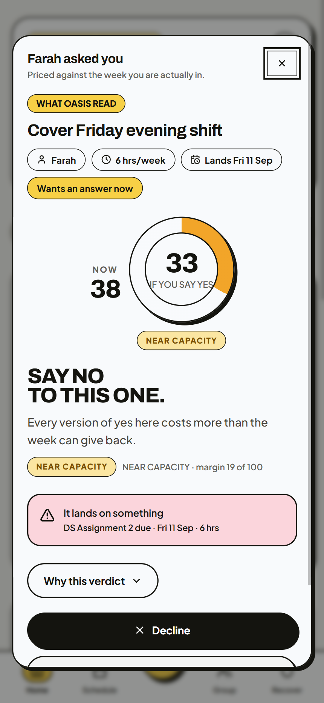</p><b>4 · Verdict</b><br>Farah asks Maya to cover Friday evening. Oasis reads 6 hrs, landing Fri 11 Sep, wanted now: 38 now, 33 if she says yes, margin 19 of 100 — <i>Say no to this one.</i> It names the collision (DS Assignment 2 due the same day), and <i>Why this verdict</i> lists every penalty.</td>
</tr>
<tr>
<td width="50%" valign="top"><p align="center">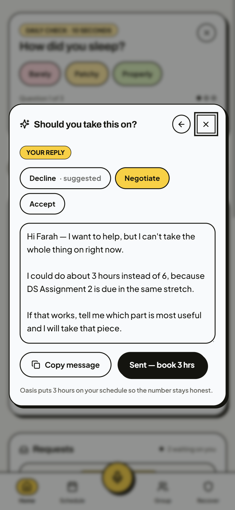</p><b>5 · Reply</b><br>Decline is suggested; Maya picks <i>Negotiate</i> and gets a draft offering about 3 hours instead of 6, because DS Assignment 2 is due in the same stretch. <i>Copy message</i> — she sends it herself. <i>Sent — book 3 hrs</i>: Oasis puts 3 hours on her schedule so the number stays honest.</td>
<td width="50%" valign="top"><p align="center">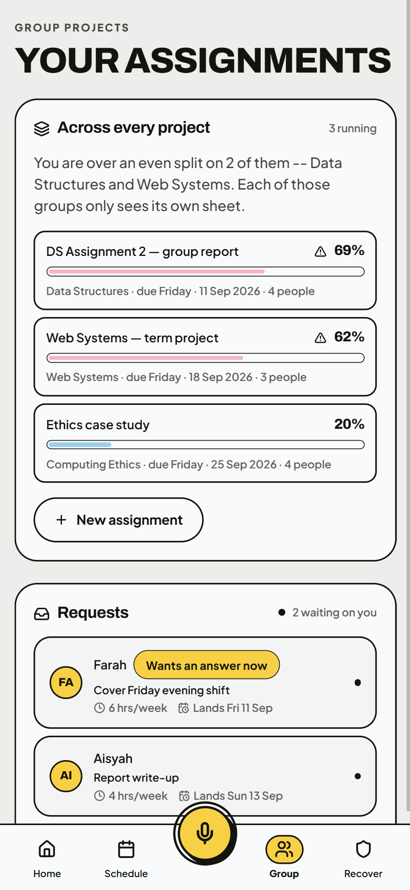</p><b>6 · Group</b><br>Every assignment she is in, with her share of the work: DS Assignment 2 69%, Web Systems 62%, Ethics 20%. <i>New assignment</i> mints an invite code and link.</td>
</tr>
<tr>
<td width="50%" valign="top"><p align="center">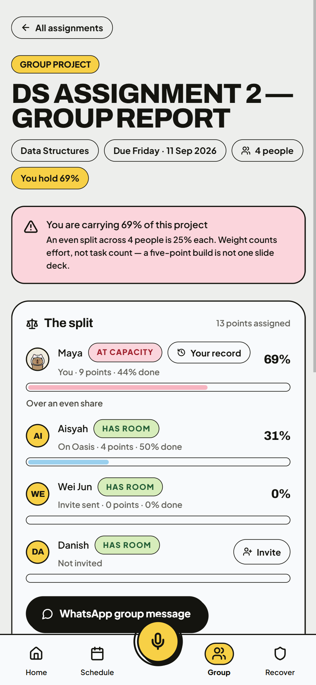</p><b>7 · The split</b><br>DS Assignment 2 — Group Report, 4 people, 13 points assigned. <i>You are carrying 69% of this project</i>, against an even 25% — weighted by effort, not task count. Teammates show capacity as a word (<i>At capacity</i>, <i>Has room</i>), never a score. <i>WhatsApp group message</i> drafts the conversation.</td>
<td width="50%" valign="top"><p align="center">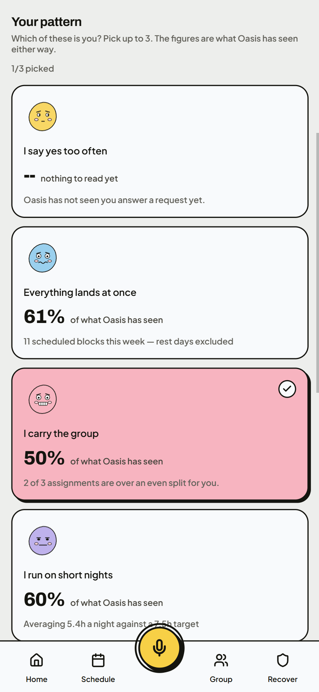</p><b>8 · Me — your pattern</b><br>Pick up to 3 patterns; Oasis attaches what it has measured, with the receipt — <i>I run on short nights</i>: 60%, averaging 5.4h a night against a 7.5h target. With no data yet, a card says <i>nothing to read yet</i> instead of showing zero.</td>
</tr>
</table>

**Design language.** A cream canvas, pastel fills, 2px ink outlines and a hard 4px offset shadow, with Archivo 800 headlines over Plus Jakarta Sans 500. The primary action is always an ink-black pill, selection is yellow, and buttons never use the health colours. The canvas itself warms as load comes off and cools as it piles on. Full spec in [DESIGN.md](DESIGN.md).

**Accessibility.** Sheets trap focus, close on Escape and return focus to the control that opened them; the six sheets use `role="dialog"` with `aria-modal` and `aria-labelledby`. Live regions announce changes in the Oasis AI panel, check-in, decision sheet, verdict card and scenario bar. Touch targets are at least 44 px, muted text meets 4.6:1 contrast, and `prefers-reduced-motion` cuts animation durations to near zero.

---

## **4. What Makes It Different**

1. **It answers the ask, not the mood.** Other apps ask how you feel. Oasis takes the actual message — *"can you cover Friday evening?"* — prices it against the week, and returns one of three outcomes. The twist is the middle one: **negotiate** books half the hours (at least 1), because most asks are not all-or-nothing.

2. **It is built for segan.** Knowing you are overloaded was never the hard part; saying it to a manager or a friend is. Oasis writes the sentence — a decline with a reason, or a counter-offer with a number in it — ready to copy. The student sends it. Oasis never does.

3. **It reads the load no calendar shows.** Commute hours, short nights, a packed timetable and heart rate against the student's own baseline sit in the same score as coursework. A six-hour shift is priced like six hours of lectures — because to the week, it is.

4. **Every number shows its working.** A deterministic weighted sum: no LLM and no trained model decide anything. *How is this worked out?* prints each deduction with its input; *Why this verdict* lists each penalty. A student can argue with a number they can see — which is what makes them trust it enough to act on it.

5. **It refuses to become the problem.**
   - Teammates never see anyone's energy score, sleep, or what they turned down — and the app says so on the How it works page, the invite sheet, the join page and the project page.
   - Capacity is shared as a word (*Has room / Loaded / At capacity*), derived from the project split, not from private health data.
   - The track record is private by default and opens from the student's own row only.
   - Nothing is read in the background, and nothing sends itself: every change from Oasis AI waits for **Confirm**.
   - No streaks, no nagging, no push notifications.
   - One phone, no account, no server today. The Building Phase server will carry only the group split.

6. **It knows where it stops.** Before Oasis AI answers, a crisis check reads the message. If it finds acute distress, the energy model gets out of the way: no score, no advice — a card with **Befrienders KL 03-7627 2929**, **Talian HEAL 15555**, **Talian Kasih 15999** and **999**, plus a pre-written message to a trusted contact (a demo contact in the prototype). It is keyword-based and runs locally — a prototype safeguard, not a clinical tool.

| | Daylio | Finch | Forest | Notion / Google Calendar | Peer evaluation form | **Oasis** |
| :-- | :-: | :-: | :-: | :-: | :-: | :-: |
| Reads the week's actual load | ❌ | ❌ | ❌ | Time blocks only | ❌ | ✅ |
| Prices a new ask before the yes | ❌ | ❌ | ❌ | ❌ | ❌ | ✅ |
| Drafts a reply from that price | ❌ | ❌ | ❌ | ❌ | ❌ | ✅ |
| Shows who carries a group project | ❌ | ❌ | ❌ | ❌ | After submission | ✅ |

---

## **5. Technical Architecture & Feasibility**

**Tech stack**

| Layer | Choice | Why | Constraints |
| :-- | :-- | :-- | :-- |
| Frontend | React 19 + TypeScript 5.7, Vite 8, Tailwind CSS v4, lucide-react | Hand-built components so every screen follows DESIGN.md; strict types over pure logic; fast builds | Mobile-first; no router library — entry links (`?demo=1`, `?join=`, `?view=`) are read from the query string |
| State (today) | React context + a pure reducer, persisted to `localStorage` (`oasis.v1`, schema 4) | No account and no server, so nothing leaves the phone; every figure is derived from one store, so no two screens disagree | Single device; clearing site data resets the week; invite links only work on the same device; a schema change falls back to the seeded week |
| Backend & database (Building Phase) | Supabase — Postgres with Row Level Security, anonymous auth tied to the invite code | Only the group split needs to sync between phones; RLS gives per-project access without writing an auth server | The free tier pauses idle projects; the anon key is public, so RLS must be tested with a second account; invite codes must become unguessable and rate-limited |
| Health data (Building Phase) | Apple HealthKit / Android Health Connect through a Capacitor wrapper | Most students have no watch, but sleep and resting heart rate already sit in the phone | Not available in a browser; iOS builds need a Mac and a developer account; a student can refuse, so the check-in stays as the fallback |
| APIs & services | None on the demo path. `wa.me` share links, the Clipboard API, local `.ics` parsing | The demo cannot fail on a network call, and the student sends every message themselves | Clipboard needs HTTPS and a tap; `.ics` import expands weekly repeats only |
| Hosting | Vercel — static build over HTTPS, from the GitHub repo | Free, fast, and HTTPS is what the Clipboard API needs | Static only until the Building Phase backend |

**System architecture**

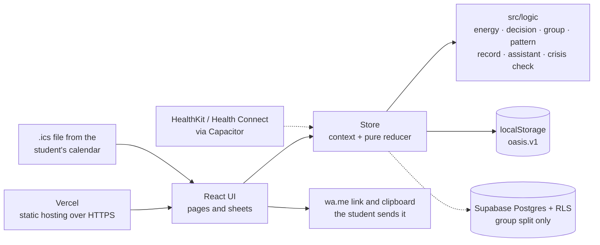

*Solid lines exist today; dashed lines are the Building Phase.*

| Module | What it does |
| :-- | :-- |
| `src/logic/energy.ts` | The five-factor weighted sum, zones, and the receipt sentence for each factor |
| `src/logic/decision.ts` | Reads a pasted chat (`parseChat`), prices the ask (`analyzeRequest`), drafts the reply (`replyFor`) |
| `src/logic/group.ts` + `compose.ts` | Effort-weighted split, the 1.5× over-share flag, the WhatsApp group and invite messages; `newProject` mints the invite code |
| `src/logic/assistantAgent.ts` / `assistantDecision.ts` | Oasis AI intents as proposals that change nothing until Confirm |
| `src/logic/pattern.ts` | Four patterns the student can name, each with a measured figure and its receipt |
| `src/logic/record.ts` | The student's own track record: on-time rate, share of team weight, achievement counts |
| `src/logic/ics.ts` / `calendarImport.ts` | Parses an `.ics` file, classifies events and flags likely duplicates before import |
| `src/logic/safetyIntervention.ts` | The crisis check before Oasis AI answers: lifelines and the trusted-contact message |

**Build plan & scope** (Building Phase, 21 Sep – 11 Oct 2026)

| Week | What we build | Owner | Why this order |
| :-- | :-- | :-- | :-- |
| Week 1 · 21–27 Sep | Supabase sync for the group split (RLS policies tested with a second account, unguessable invite codes), and phone health import via Capacitor with the check-in as fallback | Sky · Tracia | A split is only honest when every member's phone sees it, and health data removes the last manual input to the score |
| Week 2 · 28 Sep – 4 Oct | A 3–5 day burnout forecast from the same weighted sum (no ML), a suggested buffer day, and achievements wired to real events | Sky | Forecasting needs the real data week 1 brings in |
| Week 3 · 5–11 Oct | Accessibility and polish — contrast checked across the whole ambient colour range; PWA install restored (service worker; the manifest and icons are already in `public/`); a copy pass. Feature freeze 12 Oct | Huixuan · Tracia · Jacqueline | Polish goes last, on features that will not move again |

**Not in scope:** reading chats in the background, an ML stress model, Google Maps commute tracking, peer rating, a shadow calendar or location-aware recovery, and live Google OAuth calendar sync.

| Risk | Mitigation |
| :-- | :-- |
| A Figma Make sync overwrites hand-written code (it happened on 9 Sep) | The repo is the source of truth; any sync is reviewed with `git diff` before it lands |
| Health permissions refused or unavailable | Heart rate is 15 of the 100 and sleep comes from the check-in, so the score works without them |
| Live APIs failing on camera | The demo path makes no network calls; scenarios load locally |
| RLS misconfiguration exposes data | Policies per table, tested with a second account; only the split is stored — never energy, sleep or declines |
| Four people, one without an IT background | Work is split by surface (logic, frontend, design, product); larger features get a written plan in `docs/superpowers/` first |
| Scope creep | [BUILD-PLAN.md](BUILD-PLAN.md) keeps dated cut notices |

**Running it locally**

```bash
pnpm install
```

```bash
pnpm dev
```

`pnpm build` for a production bundle, `pnpm typecheck` for types, `pnpm format` to run oxfmt. Node 22 and pnpm 10.34.3 are pinned in `.mise.toml`.

**Demo entry points**

- `?demo=1` or **Shift+D** — scenario bar: *Week one · All clear · Near capacity · Red zone*.
- `?join=8FQ2` — the join page for a seeded project's invite link.
- `?view=avatars` — the mascot reference sheet.

**Docs**

| Doc | What is in it |
| :-- | :-- |
| [DESIGN.md](DESIGN.md) | The visual language and its rules |
| [BUILD-PLAN.md](BUILD-PLAN.md) | What is built, what is next, and what was cut, with dates |
| [AGENTS.md](AGENTS.md) | Project structure and conventions |
| [docs/superpowers/](docs/superpowers/) | Per-feature design specs and implementation plans |

**Team**

| Member | Role |
| :-- | :-- |
| Jacqueline Lim | Product |
| Sky Lee | Engineering — logic & backend |
| Tracia | Engineering — frontend |
| Huixuan | UI/UX |

**Status:** Prototype Phase 7–13 Sep 2026 · Building Phase 21 Sep – 11 Oct · Deployment Phase 12–31 Oct · Grand Finals 15 Nov.
